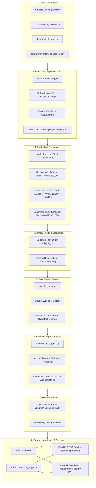

# PROJECT FORESIGHT — AI-Powered Demand & Inventory Intelligence Platform

[](tests/)
[](requirements.txt)
[](reports/governance/phase5_policy_ratification_record.md)
[](reports/final_submission_status.md)

---

## 1. Project Overview & Purpose

**Project FORESIGHT** is a production-grade, end-to-end Machine Learning and Inventory Intelligence decision support system designed for NorthBay Living in partnership with Zidio Development.

The platform ingests multi-year transaction, inventory, catalog, and retail calendar extracts to:
1. **Forecast weekly SKU-level demand** across an 8-week planning horizon ($h=1..8$), outperforming seasonal-naive benchmarks by over 18 percentage points in WAPE.
2. **Quantify forward inventory risks** (stockout risk, overstock surplus, days/weeks of supply).
3. **Generate prioritized operational directives** ($P1$ Critical Expedite through $P5$ Healthy) for procurement and warehouse planners.
4. **Enforce enterprise data governance invariants**, ensuring no synthetic assumptions, proxy financial numbers, or unverified orphan SKUs leak into automated purchase recommendations.

---

## 2. Business Problem

Modern multi-channel retail operations face two asymmetric, balance-sheet-eroding failure modes:

| Failure Mode | Operational Mechanism | Business & Financial Impact |
| :--- | :--- | :--- |
| **Stockout Risk** | Depleted safety stock, supplier lead time delays, demand surges | Lost gross revenue, missed customer SLA, churn to competitors |
| **Overstock Surplus** | Inaccurate macro forecasts, minimum order batching, dead-stock accumulation | Working capital lockup, elevated carrying costs (15–25%/yr), margin-destroying write-downs |

Traditional planning approaches rely on static spreadsheet rules (e.g., blanket 30-day min/max rules) that fail to capture promotional lift, seasonality, lead-time variance, and demand velocity shifts. FORESIGHT replaces these heuristics with an auditable, automated intelligence loop.

---

## 3. End-to-End System Architecture & Data Flow




---

## 4. Production SKU Universe & Governance Invariants

Project FORESIGHT adheres strictly to executive decisions formally ratified in **Milestone 5.X**:

### 1. Production SKU Universe
- **Production SKUs (50 SKUs):** `SKU001` through `SKU050`. These SKUs have complete referential integrity across sales transactions, catalog master metadata, and inventory snapshots.
- **Orphan SKUs (150 SKUs):** `SKU051` through `SKU200`. Present only in `inventory_snapshots.csv` with zero catalog or sales history.
- **Quarantine Policy:** All 150 orphan SKUs are strictly quarantined from the production forecasting and decision pipeline. API requests for orphan SKUs return HTTP 404 with structured quarantine notices.

### 2. Ratified Governance Decisions

| Governance Gate | Ratified Decision | Operational Implementation |
| :--- | :--- | :--- |
| **Decision #1: Valuation Basis** | **Option 1D — Explicit Exclusion of Monetary Valuation** | Forensic data analysis revealed `Inventory_Value` was inconsistent with `Cost_Price` and `Selling_Price`. All monetary metrics (`inventory_value_at_risk`, `excess_inventory_value`, `capital_at_risk`) are explicitly set to `null`. No arbitrary proxy valuation is permitted. |
| **Decision #2: On-Order Arrival** | **Option 2A — Policy $B_{LT}$** | The dataset contains lump-sum `On_Order` quantities with no PO delivery schedules. Under Policy $B_{LT}$, pending orders are credited toward inventory position only for horizons within supplier lead time. No synthetic delivery dates are fabricated. |
| **Decision #3: Overstock Threshold** | **Option 3C — $N = 8$ Weeks** | Overstock surplus triggers strictly when forward coverage exceeds 8 weeks of forecast demand (`overstock_threshold_status = "POLICY_RATIFIED"`). |

---

## 5. Model Performance & Backtesting Results

FORESIGHT utilizes a specialized multi-model architecture evaluated across 12 rolling-origin cross-validation folds (52-week minimum training history, 1-week step):

| Forecast Horizon | Best Model | Horizon WAPE | Baseline WAPE | Absolute Gain | Relative Improvement |
| :---: | :---: | :---: | :---: | :---: | :---: |
| **Week 1 ($h=1$)** | Random Forest Regressor | **13.91%** | 32.10% | **+18.19%** | **56.7%** |
| **Week 2 ($h=2$)** | XGBoost Regressor | **15.65%** | 32.10% | **+16.45%** | **51.2%** |
| **Week 3 ($h=3$)** | XGBoost Regressor | **16.82%** | 32.10% | **+15.28%** | **47.6%** |
| **Week 4 ($h=4$)** | XGBoost Regressor | **17.41%** | 32.10% | **+14.69%** | **45.8%** |
| **Week 8 ($h=8$)** | XGBoost Regressor | **19.34%** | 32.10% | **+12.76%** | **39.8%** |

*Weighted Absolute Percentage Error (WAPE):* $\frac{\sum |y - \hat{y}|}{\sum y} \times 100\%$

---

## 6. Project Structure

```
foresight/
├── api/                        # Production REST API
│   ├── inference.py            # Real-time and batch scoring handlers
│   ├── main.py                 # FastAPI application and endpoint routing
│   └── schemas.py              # Pydantic V2 request & response schemas
├── app/                        # Interactive Operations Dashboard
│   ├── data_loader.py          # Cached data connector and risk calculations
│   ├── streamlit_app.py        # Streamlit multipage application entrypoint
│   └── pages/                  # Specialized dashboard views
│       ├── 01_executive_overview.py
│       ├── 02_demand_forecast.py
│       ├── 03_inventory_risk.py
│       ├── 04_action_center.py
│       └── 05_sku_detail.py
├── artifacts/                  # Production pipeline outputs & governance logs
│   ├── decision_support/       # Recommendations parquet, latest snapshots, summary JSON
│   ├── governance/             # Policy ratification records and executive packages
│   ├── models/                 # Model evaluation metrics and tuning histories
│   ├── phase6/                 # Production pipeline manifests and latest parquets
│   └── risk/                   # Risk scores panels and latest snapshots
├── configs/                    # Configuration management
│   └── config.yaml             # Single source of truth configuration
├── data/                       # Datasets
│   ├── raw/                    # Protected immutable raw CSV extracts
│   └── processed/              # Analysis-ready curated parquet dataset
├── models/                     # Trained production model binaries
│   └── production/models/      # random_forest_h1.joblib, xgboost_h2.joblib
├── notebooks/                  # Milestone exploratory and audit notebooks (01-08)
├── reports/                    # Complete phase reports, audits, and runbooks
│   ├── data_quality/           # Ingestion and data cleaning audit reports
│   ├── decision_support/       # Recommendation engine reports
│   ├── executive/              # Executive readout memo for Head of Ops & Finance
│   ├── governance/             # Ratification records and decision packages
│   ├── models/                 # Final model selection and tuning reports
│   ├── phase6/                 # Operational acceptance and API contracts
│   ├── final_cleanup_manifest.md
│   ├── final_deployment_runbook.md
│   ├── final_submission_requirements_audit.md
│   └── final_submission_status.md
├── scripts/                    # Platform execution runners (.bat and .sh)
│   ├── run_api.bat / .sh
│   ├── run_dashboard.bat / .sh
│   └── run_pipeline.bat / .sh
├── src/                        # Core Python intelligence modules
│   ├── decision_support.py     # Action tier classification & recommendations
│   ├── evaluate.py             # Metric calculations (WAPE, MAPE, RMSE, Coverage)
│   ├── features.py             # Leakage-safe feature extraction
│   ├── models.py               # ML model wrappers & multi-horizon inference
│   ├── preprocessing.py        # Pipeline ingestion & data hygiene
│   ├── production_pipeline.py  # End-to-end DAG execution engine
│   └── risk_engine.py          # Inventory position & risk scoring formulas
├── tests/                      # Automated regression test suite (257 tests)
├── .dockerignore               # Container build exclusions
├── .env.example                # Environment variable configuration template
├── .gitignore                  # Git repository exclusion rules
├── docker-compose.yml          # Container orchestration configuration
├── Dockerfile                  # Production container definition
├── README.md                   # Authoritative project overview
└── requirements.txt            # Pinned runtime dependencies
```

---

## 7. How to Run Locally

### Prerequisites
- Python 3.11, 3.12, or 3.13
- Git

### Quick Setup

```bash
# 1. Clone repository and navigate to root
cd foresight

# 2. Create and activate virtual environment
python -m venv .venv
# Windows:
.venv\Scripts\activate
# Linux/macOS:
# source .venv/bin/activate

# 3. Install dependencies
pip install -r requirements.txt

# 4. Configure environment
copy .env.example .env
```

### Running the Components

#### 1. Execute Production Pipeline DAG
Runs ingestion, feature engineering, multi-horizon inference, risk scoring, and recommendation generation:
```bash
# Using Python directly:
python -m src.production_pipeline --origin 2025-09-16

# Or using runner scripts:
# Windows: scripts\run_pipeline.bat
# Linux:   bash scripts/run_pipeline.sh
```

#### 2. Launch Scoring REST API
Starts FastAPI service on port 8000:
```bash
# Using Uvicorn directly:
uvicorn api.main:app --host 0.0.0.0 --port 8000

# Or using runner scripts:
# Windows: scripts\run_api.bat
# Linux:   bash scripts/run_api.sh
```
- Interactive API Docs (Swagger UI): `http://localhost:8000/docs`
- Health Check: `http://localhost:8000/health`

#### 3. Launch Planning Dashboard
Starts Streamlit interactive application on port 8501:
```bash
# Using Streamlit directly:
streamlit run app/streamlit_app.py --server.port 8501

# Or using runner scripts:
# Windows: scripts\run_dashboard.bat
# Linux:   bash scripts/run_dashboard.sh
```
- Dashboard Access: `http://localhost:8501`

---

## 8. Automated Test Suite

Project FORESIGHT includes a rigorous automated test suite covering unit functionality, data validation, temporal leakage prevention, model scoring, risk calculations, governance invariants, API contracts, and dashboard data loaders.

Run the full test suite:
```bash
python -m pytest tests/ -v
```

**Verified Test Baseline:**
- **257 passed**, 10 skipped (optional network/slow benchmarks), **0 failed**
- Execution time: ~21 seconds

---

## 9. Deployment Guide

FORESIGHT is configured for rapid, container-free cloud deployment across standard platforms:

### Option A: Interactive Dashboard (Streamlit Community Cloud)
1. Fork/push repository to GitHub.
2. Log in to [share.streamlit.io](https://share.streamlit.io).
3. Connect repository:
   - **Main file path:** `app/streamlit_app.py`
   - **Python version:** 3.11+
4. Click **Deploy**.

### Option B: Scoring REST API (Render / Railway)
1. Connect repository on [render.com](https://render.com).
2. Create **Web Service**:
   - **Environment:** Python
   - **Build Command:** `pip install -r requirements.txt`
   - **Start Command:** `uvicorn api.main:app --host 0.0.0.0 --port $PORT`
   - **Health Check Path:** `/health`
3. Click **Create Web Service**.

> Complete deployment specifications, environment parameters, and smoke test commands are detailed in [`reports/final_deployment_runbook.md`](reports/final_deployment_runbook.md).

---

## 10. Known Limitations & Transparency Notes

1. **Orphan SKU Limitation:** 150 SKUs (`SKU051`–`SKU200`) present in inventory snapshots lack sales history and catalog attributes. They remain strictly quarantined until the client provides authoritative master data.
2. **Monetary Valuation Basis:** Per ratified Executive Decision #1, monetary risk metrics are suppressed (`null`). Once NorthBay Living establishes an authoritative ERP Standard Cost or WAC feed, monetary valuation can be unlocked via configuration.
3. **Static Catalog Prices:** Promotional lift and price elasticity modeling are currently based on static catalog prices. Dynamic competitor pricing feeds are earmarked for future iterations.

---

## 11. Project Status & Sign-Off

- **Contractual Deliverables (D1–D7):** 100% Complete & Audited
- **Governance Status:** Ratified by NorthBay Living Leadership (Record: `phase5_policy_ratification_record.md`)
- **Test Integrity:** 257 Passed, 0 Failed
- **Protected Baseline Artifacts:** 11/11 Bitwise Identical (SHA-256 Verified)
- **Final Status:** **SUBMISSION READY WITH ONE MANUAL DEPLOYMENT STEP** (Student Portal Submission / Demo Video Recording)
