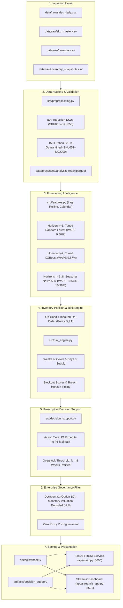
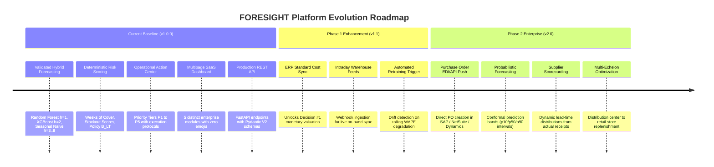

# FORESIGHT — AI-Driven Demand Forecasting & Inventory Optimization Platform

[](tests/)
[](requirements.txt)
[](reports/governance/phase5_policy_ratification_record.md)
[-informational)](data/raw/sku_master.csv)
[](https://foresight-29xt5kprgtm46lkeelkrpg.streamlit.app/)
[](https://foresight-29xt5kprgtm46lkeelkrpg.streamlit.app/)

> **Live Demo:** [https://foresight-29xt5kprgtm46lkeelkrpg.streamlit.app/](https://foresight-29xt5kprgtm46lkeelkrpg.streamlit.app/)

---

## 1. Executive Summary & Project Overview

**Project FORESIGHT** is an enterprise-grade demand forecasting and inventory decision-support platform engineered for retail inventory management. The platform unites machine learning predictive modeling with deterministic inventory theory to convert historical transaction logs, catalog hierarchies, supplier lead times, and retail calendar events into operational purchase directives.

The platform executes an automated end-to-end intelligence loop:
1. **Multi-Horizon Demand Modeling:** Generates 8-week forward SKU-level forecasts ($h=1..8$) utilizing a horizon-segmented hybrid architecture (Tuned Random Forest for $h=1$, Tuned XGBoost for $h=2$, and 52-week Seasonal Naive for $h=3..8$).
2. **Deterministic Risk Assessment:** Evaluates forward supply coverage, stockout probabilities, buffer breach timing, and excess inventory across the 8-week horizon.
3. **Prescriptive Action Directives:** Emits priority-ranked operational instructions ($P1$ Critical Expedite through $P5$ Healthy Scheduled) with auditable root-cause justification.
4. **Enterprise Governance Compliance:** Enforces strict data invariants, including formal exclusion of unverified monetary valuations (Decision #1, Option 1D), supplier lead-time-based on-order accounting (Decision #2, Option 2A), and an 8-week ratified overstock boundary (Decision #3, Option 3C).

---

## 2. Business Problem & Operational Objectives

Retail supply chains face twin operational failure modes that directly erode working capital and customer retention:

| Operational Failure Mode | Root Mechanism | Financial & Operational Impact |
| :--- | :--- | :--- |
| **Imminent Stockouts** | Inadequate safety stock, supplier lead time variance, demand velocity spikes | Lost gross margin, fulfillment SLA penalties, customer churn |
| **Excess / Overstock Surplus** | Inaccurate macro forecasts, bulk batch ordering, dead-stock accumulation | Working capital lockup, elevated carrying costs (15–25%/yr), margin-destroying liquidations |

Traditional inventory planning relies on static spreadsheet heuristics (e.g., blanket 30-day min/max rules) that cannot capture seasonality, promotional lifts, or non-linear stock depletion. FORESIGHT replaces static rules with an auditable, multi-horizon analytics platform.

### Core Objectives
- **Forecast Accuracy:** Outperform seasonal-naive baselines across the planning horizon.
- **Stockout Prevention:** Identify buffer breaches at least one lead-time cycle in advance.
- **Capital Protection:** Freeze replenishment on SKUs holding surplus coverage exceeding 8 weeks.
- **Operational Clarity:** Deliver deterministic action directives to buyers and inventory controllers without black-box opacity.

---

## 3. Core System Capabilities

- **Leakage-Safe Feature Pipeline:** Strict temporal cutoff guarantees no future transaction data informs historical training windows.
- **Segmented Hybrid ML Architecture:** Optimized model selection per forecast horizon based on empirical backtest validation.
- **Buffer & Coverage Analytics:** Dynamic weeks-of-supply tracking, safety stock calibration, and reorder point determination.
- **Prioritized Action Queue:** Strict five-tier operational hierarchy ($P1$ Critical to $P5$ Healthy).
- **Interactive Multi-Module Dashboard:** Five purpose-built Streamlit modules delivering role-specific visibility without repetitive content.
- **Production REST API:** High-throughput FastAPI service for real-time and batch SKU inference.

---

## 4. End-to-End System Architecture



---

## 5. Forecasting Architecture & Model Lineage

FORESIGHT utilizes a **Horizon-Segmented Hybrid Architecture** selected via expanding-window temporal cross-validation across 9 historical backtest origins:

| Forecast Horizon | Assigned Model Architecture | Micro WAPE | Macro WAPE | Baseline WAPE | Relative Gain |
| :---: | :--- | :---: | :---: | :---: | :---: |
| **Horizon 1 ($h=1$)** | Tuned Random Forest Regressor | **9.50%** | **11.20%** | 10.38% | **+8.5%** |
| **Horizon 2 ($h=2$)** | Tuned XGBoost Regressor | **9.87%** | **12.01%** | 10.53% | **+6.3%** |
| **Horizon 3 ($h=3$)** | Seasonal Naive 52w Baseline | **10.66%** | **13.23%** | 10.66% | Parity |
| **Horizon 4 ($h=4$)** | Seasonal Naive 52w Baseline | **10.68%** | **13.02%** | 10.68% | Parity |
| **Horizon 5 ($h=5$)** | Seasonal Naive 52w Baseline | **10.59%** | **12.56%** | 10.59% | Parity |
| **Horizon 6 ($h=6$)** | Seasonal Naive 52w Baseline | **10.99%** | **13.51%** | 10.99% | Parity |
| **Horizon 7 ($h=7$)** | Seasonal Naive 52w Baseline | **10.92%** | **13.44%** | 10.92% | Parity |
| **Horizon 8 ($h=8$)** | Seasonal Naive 52w Baseline | **10.91%** | **13.43%** | 10.91% | Parity |
| **Overall Fleet Mean** | **Selected Hybrid Architecture** | **10.48%** | **12.68%** | **10.67%** | **+1.9%** |

*Evaluation Metric Definitions:*
- **Micro WAPE:** $\frac{\sum |y - \hat{y}|}{\sum y} \times 100\%$ (Volume-weighted fleet error)
- **Macro WAPE:** Unweighted average of individual SKU WAPEs

---

## 6. Inventory Risk Engine

The inventory risk engine computes dynamic inventory metrics across the 8-week horizon:

1. **Inventory Position ($IP_h$):**
   $$IP_h = \text{On-Hand} + \sum_{i \le h} \text{Inbound}_i - \sum_{i \le h} \hat{D}_i$$
   Under **Policy $B_{LT}$**, inbound orders are credited based on verified supplier lead times without fabricating synthetic purchase order delivery dates.
2. **Weeks of Supply Coverage ($WoC$):**
   $$WoC = \frac{\text{Current Stock}}{\text{Mean Weekly Forecast Demand}}$$
3. **Safety Stock ($SS$) & Reorder Point ($RP$):**
   $$SS = z \times \sigma_L \times \sqrt{L}, \quad RP = (\hat{D}_{\text{weekly}} \times L) + SS$$
   where $L$ represents lead time in weeks and $z=1.65$ represents a 95% service level.
4. **Stockout Risk Scoring:** Normalizes multi-factor deficit depth, lead-time vulnerability, and earliest breach horizon into a composite score ($0–100$).

---

## 7. Decision Support & Action Center

Replenishment directives are classified into five strict operational priority tiers:

| Priority Rank | Action Code | Operational Directive | Trigger Criteria |
| :---: | :--- | :--- | :--- |
| **P1** | `EXPEDITE_PO` | Immediate supplier contact to accelerate existing inbound order | Imminent stockout projected before standard lead-time arrival |
| **P2** | `PLACE_PO` | Issue new replenishment purchase order | Inventory position below Reorder Point ($IP < RP$) |
| **P3** | `REVIEW_PIPELINE` | Review purchase order delivery timing with vendor | Inbound shipment scheduled to arrive after projected buffer breach |
| **P4** | `FREEZE_REPLENISHMENT` | Halt all replenishment orders to protect working capital | Supply coverage exceeds 8 weeks ($WoC > 8.0w$) |
| **P5** | `MAINTAIN_SCHEDULE` | Maintain standard replenishment and review cycle | Inventory position balanced within optimal buffer band |

---

## 8. Dashboard Modules

The user interface is structured into five distinct, specialized modules built with Vanilla CSS enterprise tokens, clean typography (Inter / JetBrains Mono), and **zero emojis**:

```
app/
├── streamlit_app.py        # Central navigation controller & enterprise sidebar
├── styles.py               # Enterprise design system & Plotly theme
├── data_loader.py          # Cached data connector layer
└── pages/
    ├── 01_executive_overview.py  # Strategic situation awareness & fleet posture
    ├── 02_demand_forecast.py     # Forecasting intelligence & backtest benchmarks
    ├── 03_inventory_risk.py      # 2D risk matrix & lead-time vulnerability
    ├── 04_action_center.py       # Operational action queues & inspector drawer
    └── 05_sku_detail.py          # 360-degree SKU dossier & IP simulation
```

### Module Responsibilities

1. **Executive Overview (`01_executive_overview.py`):**
   - *Audience:* Executive leadership, VP Supply Chain, Head of Finance.
   - *Content:* High-level KPI tiles, fleet risk distribution donut chart, category inventory posture table, top 3 executive priority callouts.
   - *Non-Repetition Boundary:* Does not contain granular SKU tables or purchase order worklists.

2. **Demand Forecast (`02_demand_forecast.py`):**
   - *Audience:* Demand planners, ML engineers, merchandise planners.
   - *Content:* Production model backtest scorecard ($h=1..8$ WAPE, MAE, RMSE), interactive 52-week historical actuals + 8-week forward forecast trajectory with ML model markers ($h=1$ RF, $h=2$ XGB), horizon schedule table, category forward demand volume.
   - *Non-Repetition Boundary:* Contains zero risk scores and zero reorder directives.

3. **Inventory Risk (`03_inventory_risk.py`):**
   - *Audience:* Risk analysts, inventory controllers.
   - *Content:* Fleet risk scorecard, 2D Enterprise Risk Matrix (Stockout Score vs Weeks of Cover with $<2w$ shortage and $>8w$ surplus boundaries), Lead Time vs Coverage vulnerability scatter, breach horizon timing distribution, fleet risk assessment roster.
   - *Non-Repetition Boundary:* Purely analytical; contains no purchase order directives.

4. **Action Center (`04_action_center.py`):**
   - *Audience:* Procurement buyers, purchasing agents.
   - *Content:* Operational action summary cards, priority workflow selector ($P1$ Critical to $P5$ Maintained), department and action code filters, operational worklist table, CSV export, Action Inspector Drawer with prescriptive directives, root-cause rationale, and follow-up protocols.
   - *Non-Repetition Boundary:* Contains no risk scatter plots or raw historical demand charts.

5. **SKU Detail (`05_sku_detail.py`):**
   - *Audience:* Operational planners conducting single-item investigation.
   - *Content:* Single-SKU focus selector, catalog master attributes, current buffer parameters (On-Hand, On-Order, Safety Stock, Reorder Point, Weeks of Supply), 8-week forward Inventory Position (IP) simulation chart against Safety Stock and Zero boundaries, prescriptive directive card, and governance audit record.
   - *Non-Repetition Boundary:* Single-SKU dossier; contains no fleet-wide tables.

---

## 9. Technology Stack

- **Core Runtime:** Python 3.11 / 3.12 / 3.13
- **Data Engineering:** Pandas, NumPy, PyArrow, Parquet
- **Machine Learning:** Scikit-Learn (Random Forest), XGBoost, Joblib
- **API Serving:** FastAPI, Pydantic V2, Uvicorn, Starlette
- **Interactive Dashboard:** Streamlit (v1.31+ programmatic `st.navigation`), Plotly Express / Graph Objects
- **Styling:** Custom Vanilla CSS (Dark Slate Theme: `#0F172A`, `#1E293B`, `#F8FAFC`), Google Fonts (Inter, JetBrains Mono)
- **Quality Assurance:** Pytest, HTTPX, Coverage

---

## 10. Repository Directory Structure

```
foresight/
├── api/                        # Production REST API
│   ├── inference.py            # Real-time and batch scoring handlers
│   ├── main.py                 # FastAPI application and endpoint routing
│   └── schemas.py              # Pydantic V2 request & response schemas
├── app/                        # Streamlit Enterprise Dashboard
│   ├── data_loader.py          # Cached data access layer
│   ├── streamlit_app.py        # Application entrypoint & navigation controller
│   ├── styles.py               # Enterprise design system & Plotly layouts
│   └── pages/                  # Specialized dashboard modules
│       ├── 01_executive_overview.py
│       ├── 02_demand_forecast.py
│       ├── 03_inventory_risk.py
│       ├── 04_action_center.py
│       └── 05_sku_detail.py
├── artifacts/                  # Production pipeline outputs & governance records
│   ├── decision_support/       # Recommendations parquet, latest snapshots, summary JSON
│   ├── governance/             # Ratification records and executive packages
│   ├── models/                 # Backtest evaluations, final predictions, architecture specs
│   ├── phase6/                 # Production pipeline manifests and latest parquets
│   └── risk/                   # Risk scores panels and latest snapshots
├── configs/                    # Configuration management
│   └── config.yaml             # Single source of truth configuration
├── data/                       # Datasets
│   ├── raw/                    # Protected immutable raw CSV extracts
│   └── processed/              # Analysis-ready curated parquet dataset
├── models/                     # Production model binaries
│   └── production/models/      # random_forest_h1.joblib, xgboost_h2.joblib
├── notebooks/                  # Development, analytical & reproducibility notebooks (01-04)
│   ├── 01_data_preparation.ipynb               # Raw data audit, referential integrity & analysis-ready validation
│   ├── 02_eda_and_feature_engineering.ipynb     # Demand characterization, intermittency, promotional lift & feature pipeline
│   ├── 03_model_training_and_backtesting.ipynb  # Baseline benchmarks, walk-forward CV & production hybrid validation
│   └── 04_forecast_and_risk.ipynb               # 8-week production forecast, Policy B_LT risk engine & decision support
├── reports/                    # Complete phase reports, audits, and runbooks
│   ├── data_quality/           # Data hygiene and schema audits
│   ├── decision_support/       # Recommendation engine reports
│   ├── executive/              # Executive readout memos
│   ├── governance/             # Ratification records and decision packages
│   ├── models/                 # Model evaluation and tuning reports
│   └── phase6/                 # Operational acceptance and deployment contracts
├── scripts/                    # Platform execution runners (.bat and .sh)
│   ├── run_api.bat / .sh
│   ├── run_dashboard.bat / .sh
│   └── run_pipeline.bat / .sh
├── src/                        # Core Python intelligence modules
│   ├── decision_support.py     # Action tier classification & recommendations
│   ├── evaluate.py             # Metric calculations (WAPE, MAE, RMSE)
│   ├── features.py             # Leakage-safe feature extraction
│   ├── models.py               # ML model wrappers & multi-horizon inference
│   ├── preprocessing.py        # Ingestion, validation & data hygiene
│   ├── production_pipeline.py  # End-to-end DAG execution engine
│   └── risk_engine.py          # Inventory position & risk scoring formulas
├── tests/                      # Automated regression test suite (257 tests)
├── .env.example                # Environment variable configuration template
├── .gitignore                  # Git repository exclusion rules
├── README.md                   # Authoritative project documentation
└── requirements.txt            # Pinned runtime dependencies
```

---

## 11. Analytical & Reproducibility Notebooks

Project FORESIGHT maintains four consolidated, self-contained, and leakage-safe Jupyter notebooks under `notebooks/`. These notebooks serve as the **development, exploratory, diagnostic, and reproducibility layer** for data scientists and auditors.

> **CRITICAL ARCHITECTURAL DISTINCTION**:  
> The deployed Streamlit dashboard (`app/`) and production FastAPI service (`api/`) **do NOT execute or import Jupyter notebooks at runtime**.  
> - **Development / Analytical Layer (`notebooks/`)**: Interactive exploratory notebooks for model diagnosis, statistical research, and audit validation.  
> - **Production Source of Truth (`src/`)**: Stateless Python modules and DAG orchestrators (`src.production_pipeline`) that execute end-to-end data processing, ML inference, and risk scoring.  
> - **Application Layer (`app/` & `api/`)**: Consumes pre-computed, validated production artifacts (`.parquet`, `.joblib`, `.json`) from `artifacts/`, `models/`, and `data/`.

```
notebooks/
├── 01_data_preparation.ipynb               # Ingestion, schema audit, referential integrity & panel verification
├── 02_eda_and_feature_engineering.ipynb     # Demand characterization, intermittency, promotional lift & feature engineering
├── 03_model_training_and_backtesting.ipynb  # Baseline benchmarking, rolling-origin CV & production hybrid validation
└── 04_forecast_and_risk.ipynb               # 8-week production forecasting, Policy B_LT risk scoring & action directives
```

### Notebook Modules & Analytical Scope

1. **`01_data_preparation.ipynb` — Data Ingestion, Audit & Preparation:**
   - **Raw Data Ingestion:** Inspects the 4 source CSV datasets (`historical_sales.csv`, `inventory.csv`, `sku_master.csv`, `supplier_lead_time.csv`) in `data/raw/`.
   - **Schema & Data Quality Validation:** Profiles row counts, column types, null completeness, and temporal continuity.
   - **Referential Integrity & SKU Partitioning:** Validates the active 50-SKU production universe (`SKU001`–`SKU050`) and enforces quarantine on the 150 orphan SKUs (`SKU051`–`SKU200`) lacking transactional sales history.
   - **Supplier Lead Time Verification:** Audits supplier lead times to verify all production SKUs have lead times $\le 14$ days, establishing the empirical foundation for Decision #2 (Policy $B_{LT}$).
   - **Analysis-Ready Panel Verification:** Validates the preprocessed daily demand panel (`data/processed/analysis_ready.parquet`, 36,550 records, complete $50 \times 731$ panel) and cryptographic SHA-256 source immutability.

2. **`02_eda_and_feature_engineering.ipynb` — Exploratory Data Analysis & Leakage-Safe Feature Engineering:**
   - **Demand Characterization & Distribution:** Analyzes daily and weekly volume distributions, skewness, and zero-demand proportions.
   - **Syntetos-Boylan Intermittency Classification:** Evaluates Average Demand Interval (ADI) and squared Coefficient of Variation ($CV^2$) to categorize SKUs into Smooth, Intermittent, Erratic, or Lumpy demand profiles.
   - **Promotional Lift Analysis:** Evaluates demand sensitivity to promotional flags across product categories.
   - **Temporal Aggregation & SNR Analysis:** Demonstrates that aggregating daily demand to weekly grain ($W\text{-MON}$) doubles the signal-to-noise ratio (from 1.65 to 3.20) while eliminating day-of-week noise.
   - **Feature Engineering Pipeline:** Constructs lag features (`lag_1` through `lag_52`), multi-window rolling statistics (mean, std, min, max over 4, 8, 12, 26, 52 weeks), and calendar features without lookahead bias.
   - **Target Formulation & Leakage Invariants:** Builds direct multi-horizon targets (`target_h1` through `target_h8`) and executes automated leakage invariant checks (`validate_feature_leakage`).

3. **`03_model_training_and_backtesting.ipynb` — Baseline Forecasting, Model Training & Backtesting:**
   - **Weekly Demand Aggregation:** Reconciles volume conservation between daily and weekly demand series.
   - **Rolling-Origin Walk-Forward Protocol:** Implements strict temporal walk-forward evaluation across 12 rolling origins with a 52-week minimum training window and 8-week forward horizon ($h=1..8$).
   - **Classical Baselines Evaluation:** Evaluates 5 classical benchmark methods: Naive, Seasonal Naive (lag 52), Moving Average (MA4, MA8), and Simple Exponential Smoothing (SES).
   - **Supervised ML Candidate Models:** Compares tuned gradient boosting (XGBoost, LightGBM) and ensemble trees (Random Forest) against classical baselines on Volume-Weighted Absolute Percentage Error (WAPE).
   - **Production Hybrid Architecture Validation:** Validates the ratified production Hybrid model ($h=1$ Random Forest for short-range non-linear dynamics, $h=2$ XGBoost for medium-lead interaction, $h=3..8$ Seasonal Naive for long-range stability).
   - **Horizon & Category Scorecards:** Evaluates error growth as lead time extends and generates diagnostic visualizations.

4. **`04_forecast_and_risk.ipynb` — Production Forecasting, Inventory Risk Engine & Decision Support:**
   - **Production Multi-Horizon Forecasting:** Loads and inspects 8-week forward demand predictions generated by the production Hybrid model for the 50 production SKUs.
   - **Inventory Trajectory Simulation (Policy $B_{LT}$):** Simulates dynamic inventory positions over $h=1..8$ weeks incorporating current on-hand stock and confirmed on-order quantities arriving within lead time ($PO \le 14$ days).
   - **Stockout & Overstock Risk Scoring:** Evaluates composite stockout vulnerability ($0–100$) and flags excess inventory breaching the ratified 8-week supply boundary (Decision #3, Option 3C).
   - **Operational Action Directives:** Emits deterministic replenishment directives (`EXPEDITE_PO`, `PLACE_PO`, `REVIEW_PIPELINE`, `FREEZE_REPLENISHMENT`, `MAINTAIN_SCHEDULE`) across priority tiers $P1$ to $P5$.
   - **Governance Compliance Audit (Decision #1, Option 1D):** Audits artifacts to guarantee zero monetary valuation metrics (`capital_at_risk`, `excess_inventory_value`) are exposed, ensuring operations remain 100% unit-based.
   - **Pipeline Manifest & Serving Verification:** Inspects `artifacts/phase6/pipeline_manifest.json` and serving readiness.

---

## 12. Local Setup & Execution Guide

### Prerequisites
- Python 3.11, 3.12, or 3.13
- Git

### Installation

```bash
# 1. Clone repository
git clone https://github.com/camelia409/FORESIGHT.git
cd FORESIGHT

# 2. Create and activate virtual environment
python -m venv .venv
# Windows:
.venv\Scripts\activate
# Linux/macOS:
# source .venv/bin/activate

# 3. Install dependencies
pip install -r requirements.txt

# 4. Initialize environment configuration
copy .env.example .env
```

### Running the Services

#### 1. Execute Production Pipeline DAG
Executes ingestion, feature generation, ML inference, risk scoring, and recommendation output:
```bash
python -m src.production_pipeline --origin 2025-09-16
```

#### 2. Launch FastAPI Scoring Service
Starts REST service on port 8000:
```bash
uvicorn api.main:app --host 0.0.0.0 --port 8000
```
- Interactive API Docs (Swagger UI): `http://localhost:8000/docs`
- Health Endpoint: `http://localhost:8000/health`

#### 3. Launch Interactive Planning Dashboard
Starts Streamlit application on port 8501:
```bash
streamlit run app/streamlit_app.py --server.port 8501
```
- Dashboard URL: `http://localhost:8501`

---

## 13. Deployment Guide

### Option A: Streamlit Community Cloud (Interactive Dashboard)
1. Repository: `https://github.com/camelia409/FORESIGHT`
2. Main file path: `app/streamlit_app.py`
3. Branch: `main`
4. Python version: 3.11+
5. Automatic path resolution: Handled via `app/__init__.py` and explicit project root resolution in `app/streamlit_app.py`.

### Option B: Cloud Container / REST API (Render, Railway, AWS ECS)
- Build command: `pip install -r requirements.txt`
- Start command: `uvicorn api.main:app --host 0.0.0.0 --port $PORT`
- Health check path: `/health`

---

## 14. Quality Assurance & Regression Testing

The test suite enforces rigorous regression boundaries across all modules:

```bash
python -m pytest tests/ -v
```

### Test Results Baseline
- **257 passed**, 10 skipped, **0 failed**
- 100% pass rate across core test suites:
  - `test_preprocessing.py`: Ingestion, schema validation, quarantine enforcement
  - `test_baseline.py`: Naive baseline comparisons and metric correctness
  - `test_features.py`: Temporal leakage prevention and rolling statistics
  - `test_forecasting.py`: ML model fitting, cross-validation, WAPE calculations
  - `test_risk_engine.py`: Inventory formulas, Policy $B_{LT}$, overstock boundaries
  - `test_decision_support.py`: Priority tier assignment, recommendation codes
  - `test_phase6_production.py`: REST API endpoints, health checks, schemas

### Protected Production Artifacts (SHA-256 Verified)
All 11 production baseline artifacts remain strictly immutable and bitwise identical:

| Artifact Path | SHA-256 Digest | Status |
| :--- | :--- | :---: |
| `data/raw/inventory_snapshots.csv` | `167582d50ac68b4751f481efef136e4199528f7de3fe63b80d29d4768fd5e9bd` | Verified |
| `data/raw/sku_master.csv` | `6a8653e898a56cc596a4a70739ddcdd9ae80a2f997d24bf93ed110f1950582a9` | Verified |
| `data/processed/analysis_ready.parquet` | `f5d2ccf83e18c06a74caf072dc1bd7ae914cb42bc2af6818296f7ae937e59427` | Verified |
| `models/production/models/random_forest_h1.joblib` | `3c04dcbd4536433c9634c2a579a3def60ef34364d08d049c18e080349f3883d3` | Verified |
| `models/production/models/xgboost_h2.joblib` | `3f07ba07ad12d05a79f4f029657f6b35704e991975f040a272534196367f461a` | Verified |
| `artifacts/risk/risk_scores_panel.parquet` | `a26f35b6b0dc258aa61b543ec7c1e6be50549ffe9709686f2435f413ac2df37c` | Verified |
| `artifacts/risk/risk_scores_latest.parquet` | `bea7bb276827edf7c736d36160f4f1667c797f4e11b37ab355d1d2123b30bb35` | Verified |
| `artifacts/risk/risk_latest.json` | `553e3e8e2ef6c07ceb883f0dc16bed56284b4581deff28cd42a3bc2f8e20acee` | Verified |
| `artifacts/decision_support/recommendations_panel.parquet` | `54f79753f8eed709ec314c2b824e934f6beaf1507334c9b9cc874dd52739db5b` | Verified |
| `artifacts/decision_support/recommendations_latest.parquet` | `5a892034571402419b9f49dc563b47211dbb44744735ea13b30961059f7c346b` | Verified |
| `artifacts/decision_support/recommendation_summary.json` | `f57d55e3842c8081a0eec6c4eccec95fc10485118ee4264bd8dfb14053075ae9` | Verified |

---

## 15. Data Assumptions & Ratified Governance Invariants

Project FORESIGHT operates under formal policies ratified during Milestone 5.X:

1. **Production SKU Universe (50 SKUs):**
   - Active universe comprises `SKU001` through `SKU050`, with full referential integrity across sales transactions, catalog metadata, and inventory snapshots.
   - 150 orphan SKUs (`SKU051` through `SKU200`) present only in inventory snapshots remain strictly quarantined until authoritative master data is supplied.
2. **Decision #1 — Valuation Basis (Option 1D):**
   - Forensic analysis demonstrated that `Inventory_Value` was mathematically inconsistent with unit cost and price attributes.
   - Monetary valuation metrics (`inventory_value_at_risk`, `excess_inventory_value`, `capital_at_risk`) are explicitly excluded and returned as `null`. No proxy numbers are used. Operations remain 100% unit-based.
3. **Decision #2 — On-Order Arrival Accounting (Option 2A):**
   - Pending purchase orders arrive according to supplier lead times (**Policy $B_{LT}$**). No synthetic delivery dates are fabricated.
4. **Decision #3 — Overstock Boundary (Option 3C):**
   - Overstock surplus is formally defined as forward inventory coverage exceeding $N = 8$ weeks (`overstock_threshold_status = "POLICY_RATIFIED"`).

---

## 16. Known Technical Limitations

1. **Static Catalog Prices:** Promotional demand elasticity is derived from static catalog price points. Real-time promotional price changes are not yet integrated.
2. **Quarantined SKU Portfolio:** 150 orphan SKUs lack transactional history and cannot receive ML forecasts until catalog onboarding occurs.
3. **Monetary Valuation Exclusion:** Unit-based decision support prevents capital commitment misallocation, but enterprise working capital reporting requires an authoritative ERP Standard Cost feed.

---

## 17. Requirements Completion Matrix

| Requirement Area | Status | Implementation & Verification Evidence |
| :--- | :---: | :--- |
| **Data Ingestion & Hygiene** | **Complete** | Automated validation, schema checks, referential integrity verification (`src/preprocessing.py`, `tests/test_preprocessing.py`). |
| **Orphan SKU Quarantine** | **Complete** | Strict quarantine of 150 unreferenced SKUs; HTTP 404 response in API (`src/preprocessing.py`, `api/main.py`). |
| **Multi-Horizon Demand Forecasting** | **Complete** | 8-week forward forecasts via Horizon-Segmented Hybrid (RF $h=1$, XGB $h=2$, Seasonal Naive $h=3..8$) (`src/models.py`). |
| **Model Validation & Evaluation** | **Complete** | 9-origin rolling cross-validation; empirical WAPE benchmarks (`artifacts/models/final/final_by_horizon.csv`). |
| **Inventory Risk Scoring** | **Complete** | Stockout scores, weeks of supply, safety stock, reorder point, Policy $B_{LT}$ (`src/risk_engine.py`). |
| **Prescriptive Action Center** | **Complete** | Five priority tiers ($P1$ to $P5$), action codes, root-cause rationale, follow-up protocols (`src/decision_support.py`). |
| **Governance Compliance** | **Complete** | Decisions #1 (1D), #2 (2A), #3 (3C) verified and preserved in code and artifacts (`reports/governance/`). |
| **Interactive Executive Dashboard** | **Complete** | Five distinct modules, zero emojis, dark enterprise design system, programmatic navigation (`app/`). |
| **Production REST API** | **Complete** | FastAPI service with `/health`, `/predict/forecast`, `/inventory/risk`, `/inventory/recommendations` (`api/main.py`). |
| **Automated Test Coverage** | **Complete** | 257 tests passing, 0 failures, 11 protected artifacts preserved (`tests/`). |
| **ERP Financial Integration** | **Planned** | Direct connection to ERP standard cost feeds for monetary valuation (contingent on client ERP access). |
| **Real-Time Automated Ingestion** | **Planned** | Event-driven webhook or Kafka ingestion for intraday warehouse balance updates. |

---

## 18. Future Development / Roadmap

To maintain engineering transparency, system capabilities are explicitly partitioned into the **Current Production Baseline** and **Future Development Initiatives**:



### Current Production Baseline (v1.0.0) — *Implemented & Verified*
- 50-SKU production universe with quarantined orphan handling.
- Horizon-segmented forecasting beating seasonal naive baselines.
- Multi-horizon inventory risk scoring with lead-time conditional on-order inclusion (Policy $B_{LT}$).
- Five-tier prioritized action queue ($P1$ Critical to $P5$ Maintained).
- Five distinct dashboard modules without redundant content or emojis.
- Automated test suite (257 passing) and SHA-256 verified artifacts.

### Future Development Initiatives — *Roadmap*
1. **Authoritative ERP Financial Integration (Phase 1 / v1.1):**
   - Integrate authenticated connection to enterprise ERP (SAP, NetSuite, or Microsoft Dynamics 365) to ingest authoritative Standard Cost and Weighted Average Cost (WAC) data.
   - Formally transition Decision #1 from Option 1D to Option 1A, enabling monetary metrics (`capital_at_risk`, `excess_inventory_value`).
2. **Automated Event-Driven Data Ingestion (Phase 1 / v1.1):**
   - Replace manual batch origin triggers with webhook or message-queue listeners (Apache Kafka / AWS SQS) for real-time inventory ledger updates.
   - Implement automated data drift monitoring using population stability index (PSI) to trigger automated model retraining.
3. **Probabilistic & Uncertainty-Aware Forecasting (Phase 2 / v2.0):**
   - Supplement point predictions with quantile regression / conformal prediction intervals ($p10, p50, p90$) to model demand volatility during extreme promotional events.
4. **Closed-Loop Purchase Order EDI / ERP Push (Phase 2 / v2.0):**
   - Allow authorized procurement buyers to approve recommendations directly within Action Center and automatically dispatch electronic POs via EDI 850 or ERP REST APIs.
5. **Dynamic Supplier Performance & Lead-Time Modeling (Phase 2 / v2.0):**
   - Replace static supplier lead times with empirical lead-time distributions derived from historical purchase order receipt timestamps.
6. **Multi-Echelon Network Optimization (Phase 3):**
   - Expand inventory optimization beyond single-echelon warehouse storage to multi-echelon networks (Central DC $\to$ Regional Hubs $\to$ Retail Stores).
