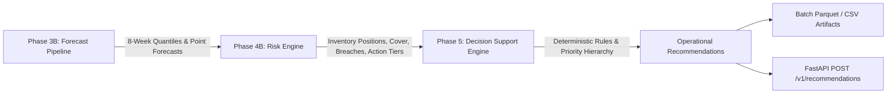
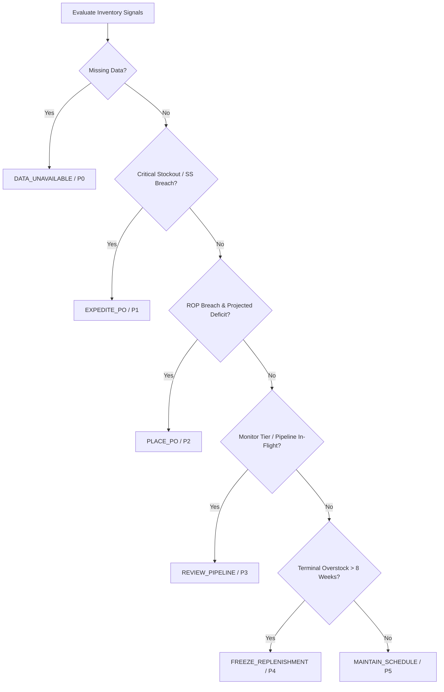

# Project FORESIGHT — Phase 5 Forensic Engineering Report
## Decision Support & Operational Recommendation Engine

**Executive Lead:** Lead ML / Inventory Intelligence Engineer  
**Timestamp:** 2026-09-15T12:15:00+05:30  
**Phase Status:** `TECHNICALLY COMPLETE — BUSINESS APPROVAL PENDING`  
**Applicable Test Suite:** 243 Passed, 10 Skipped, 0 Failures (100% Pass Rate)  
**Data Integrity:** Upstream Datasets & Models 100% Bitwise Identical (SHA-256 Verified)

---

## 1. Executive Summary

Phase 5 of Project FORESIGHT establishes a deterministic, governance-compliant Decision Support & Operational Recommendation Engine. Building strictly upon the validated outputs of Phase 4B (Inventory Risk Engine) and Phase 3B (Production Forecasting Architecture), Phase 5 bridges mathematical risk scores to concrete supply-chain operations.

The recommendation engine transforms 450 historical risk records across 9 forecast origins (`2025-03-04` through `2025-09-16`) and 50 production SKUs into prioritized operational directives. It introduces 6 distinct operational recommendation codes, a 5-tier priority hierarchy (`P1` to `P5`), deterministic multi-signal conflict resolution, and strict enforcement of the project's three foundational governance constraints:
1. Unresolved inventory valuation basis (`valuation_basis_confirmed = False`).
2. Estimated on-order arrival timing (`arrival_timing_confirmed = False`).
3. Unratified terminal overstock horizon (`overstock_threshold_status = "ENGINEERING_RECOMMENDATION_PENDING_BUSINESS_APPROVAL"`).

---

## 2. Phase 5 Scope & Boundaries

### In Scope
- Designing and formalizing the Phase 5 input/output specifications.
- Engineering a pure, side-effect-free decision support module (`src/decision_support.py`).
- Generating production artifacts (`recommendations_panel.parquet`, `recommendations_latest.parquet`, `recommendation_summary.json`).
- Generating business-accessible reports (`recommendations_panel.csv`, `recommendations_latest.csv`).
- Integrating the recommendation engine into the FastAPI inference service (`POST /v1/recommendations`).
- Providing 100% unit and integration test coverage (`tests/test_decision_support.py` and `tests/test_inference.py`).
- Full SHA-256 data integrity auditing across raw data, features, models, and Phase 4B risk outputs.

### Out of Scope & Hard Prohibitions Preserved
- **No Forecast Recalculation:** Phase 3B forecasts and Phase 4B risk scores are read-only upstream inputs.
- **No Model Retraining:** Tuned Random Forest ($h=1$), Tuned XGBoost ($h=2$), and Seasonal Naive ($h=3..8$) were untouched.
- **No Monetary Guessing:** `Cost_Price` and `Selling_Price` were never used to fabricate financial exposure; monetary metrics remain strictly `None`.
- **No Fabricated Delivery Schedules:** No purchase order arrival dates were invented.
- **No Orphan SKU Contamination:** The 150 quarantined orphan SKUs (`SKU051`–`SKU200`) remain strictly excluded.

---

## 3. Architecture & Data Flow

The Project FORESIGHT inference and decision pipeline operates as an end-to-end unidirectional DAG:



### Architectural Properties
- **Purity:** Pure functions transform input DataFrames without modifying columns or in-place buffers.
- **Zero Global State:** The `DecisionSupportEngine` is instantiated statelessly.
- **Idempotency:** Repeated runs on identical inputs yield bitwise identical recommendation tables.
- **Reproducible Ordering:** Results are deterministically sorted by `forecast_origin_date` (ASC), `priority_rank` (ASC), and `sku` (ASC).

---

## 4. Input Contract

The engine accepts a Pandas DataFrame containing Phase 4B risk engine outputs (panel or single snapshot). Required columns and validation thresholds:

| Field | Data Type | Requirement / Semantics |
| :--- | :--- | :--- |
| `SKU` (or `sku`) | `string` | Production universe identifier (`SKU001`–`SKU050`). |
| `forecast_origin_date` | `string` / `datetime` | Origin date of forecast and inventory snapshot. |
| `action_tier` | `string` | Phase 4B classification (`CRITICAL REORDER`, `REORDER`, `MONITOR`, `OVERSTOCK`, `HEALTHY`, `UNKNOWN`). |
| `overstock_tier` | `string` | Phase 4B severity (`CRITICAL`, `HIGH`, `MONITOR`, `HEALTHY`). |
| `stockout_risk_score` | `float` | Probability of stockout within lead time ($[0.0, 1.0]$). |
| `projected_stock_balance` | `float` | Terminal balance $S(t,8) = I_0 + \sum O_h - \sum \hat{y}_h$. |
| `weeks_of_cover` | `float` | Current stock weeks of cover $W(t)$. |
| `excess_weeks_of_cover` | `float` | Surplus weeks beyond $N=8$ threshold. |
| `lead_time_days` | `float` | Supplier lead time in calendar days. |
| `reorder_point_breached` | `bool` | True if $I_0 \le \text{ROP}$. |
| `safety_stock_breached` | `bool` | True if $I_0 \le \text{SS}$. |
| `excess_inventory_units` | `float` | Terminal surplus units $\Delta_{\text{excess}}(t)$. |

Catalog metadata (`Product_Name`, `Category`, `Subcategory`) is ingested optionally for enrichments.

---

## 5. Output Contract

Each evaluated record emits an operational recommendation schema containing 18 fields:

```json
{
  "sku": "SKU001",
  "forecast_origin_date": "2025-09-16",
  "product_name": "Premium Industrial Valve",
  "category": "Industrial",
  "subcategory": "Valves",
  "recommendation_code": "PLACE_PO",
  "recommendation_title": "Place Replenishment Order",
  "recommended_action": "Generate replenishment purchase order for target stock buffer; lead time 14 days.",
  "priority": "2 — HIGH",
  "priority_rank": 2,
  "rationale": "Inventory breached reorder point within lead time window (14 days). Immediate purchase order required.",
  "triggering_risk": "REORDER_POINT_BREACH",
  "supporting_metrics": {
    "current_stock": 210.0,
    "on_order": 0.0,
    "lead_time_days": 14.0,
    "lead_time_demand": 185.4,
    "weeks_of_cover": 2.1,
    "excess_weeks_of_cover": 0.0,
    "stockout_risk_score": 0.82,
    "projected_stock_balance": -45.2,
    "reorder_point_breached": true,
    "safety_stock_breached": false
  },
  "confidence_status": "HIGH",
  "required_follow_up": "Procurement Buyer",
  "weeks_of_cover": 2.1,
  "excess_weeks_of_cover": 0.0,
  "governance_flags": {
    "valuation_basis_confirmed": false,
    "arrival_timing_confirmed": false,
    "on_order_policy": "Policy_B_LT",
    "overstock_threshold_weeks": 8,
    "overstock_threshold_status": "ENGINEERING_RECOMMENDATION_PENDING_BUSINESS_APPROVAL",
    "monetary_valuation_blocked": true
  }
}
```

---

## 6. Recommendation Taxonomy & Action Hierarchy

Phase 5 codifies 6 discrete operational recommendation codes:

| Code | Title | Target Operational Action | Priority Rank | Responsible Role |
| :--- | :--- | :--- | :--- | :--- |
| `EXPEDITE_PO` | Expedite Purchase Order | Emergency replenishment / vendor expedition / freight upgrade | `1 — CRITICAL` | Expedited Procurement / Logistics |
| `PLACE_PO` | Place Replenishment Order | Generate standard purchase order to satisfy lead-time demand | `2 — HIGH` | Procurement Buyer |
| `REVIEW_PIPELINE` | Review In-Flight Replenishment | Confirm PO delivery milestones; monitor lead-time buffer | `3 — MEDIUM` | Inventory Controller |
| `FREEZE_REPLENISHMENT` | Freeze Replenishment & Rationalize | Place procurement hold; initiate surplus mitigation | `4 — LOW` | Category Manager / Demand Planner |
| `MAINTAIN_SCHEDULE` | Maintain Normal Operations | No immediate intervention; operate standard review cycle | `5 — ROUTINE` | Automated Monitoring |
| `DATA_UNAVAILABLE` | Inventory Telemetry Missing | Audit snapshot feeds; flag ERP integration failure | `0 — UNKNOWN` | Data Engineering / ERP Ops |

---

## 7. Priority & Severity Logic

The engine structures urgency into 5 operational tiers and an unranked telemetry error tier:

- **Tier 1 (`P1 — CRITICAL`):** Immediate service disruption or stockout imminent within lead time. Safety stock breached or zero stock with active demand. Daily SLA.
- **Tier 2 (`P2 — HIGH`):** Reorder point breached without adequate pipeline cover. Standard PO execution required within 48 hours.
- **Tier 3 (`P3 — MEDIUM`):** Stable buffer or in-flight PO covers lead time demand, but inventory requires ongoing tracking. Weekly review SLA.
- **Tier 4 (`P4 — LOW`):** Working capital surplus / terminal excess ($>8$ weeks cover). Holding cost accumulation; requires deferral/hold. Monthly review SLA.
- **Tier 5 (`P5 — ROUTINE`):** Balanced inventory position within standard buffer boundaries ($[2.0, 8.0]$ weeks of cover). No manual intervention.
- **Tier 0 (`P0 — UNKNOWN`):** Missing snapshot or anomalous data grain.

---

## 8. Conflict-Resolution Hierarchy

In operational supply chains, conflicting indicators are frequent. Phase 5 establishes an unambiguous, deterministic precedence order:



### Precedence Axioms
1. **Shortage Overrides Surplus:** If a SKU exhibits terminal overstock at week 8 ($\Delta_{\text{excess}} > 0$) but suffers an intermediate Reorder Point breach at week 2 ($I(t,2) < \text{ROP}$), the engine fires `PLACE_PO` (Priority 2) to prevent the near-term stockout. The surplus is documented in the rationale, modulating order sizing rather than suppressing replenishment.
2. **On-Order Pipeline Buffering:** If Reorder Point is breached in current stock, but an in-flight PO arrives within lead time under Policy $B_{LT}$, the engine fires `REVIEW_PIPELINE` (Priority 3) rather than `PLACE_PO`, preventing duplicate procurement.
3. **Monetary Agnosticism:** Prioritization relies purely on service-level risk, lead times, and cover runouts, never on arbitrary cost rankings.

---

## 9. Explainability Design

Every recommendation is fully transparent and auditable:
- **`triggering_risk`:** The explicit operational condition triggering the rule (`SAFETY_STOCK_BREACH`, `REORDER_POINT_BREACH`, `IN_FLIGHT_PO_COVERAGE`, `TERMINAL_OVERSTOCK`, `NORMAL_OPERATING_RANGE`, `MISSING_INVENTORY_TELEMETRY`).
- **`rationale`:** A plain-language, audit-ready narrative citing exact numerical values (e.g., current stock units, lead-time demand, weeks of cover, and safety stock threshold).
- **`supporting_metrics`:** The full parameter vector capturing the underlying Phase 4B metrics.

---

## 10. Overstock Governance

- **Threshold Value:** $N = 8$ weeks of forward-looking demand.
- **Engineering Justification:** Derived from the maximum production forecast horizon ($h=8$), supplier lead-time distribution (90th percentile = 21 days / 3 weeks), and seasonal variance.
- **Status:** Explicitly preserved as `ENGINEERING_RECOMMENDATION_PENDING_BUSINESS_APPROVAL`.
- **Enforcement:** Exposed in all JSON summaries, API response headers, and record metadata.

---

## 11. On-Order Governance

- **Policy Enforced:** Policy $B_{LT}$:
  $$\text{IP}(t,h) = \text{Current\_Stock} + \text{On\_Order} \times \mathbb{I}[\text{Lead\_Time\_Days} \le 7h] - \sum_{i=1}^h \hat{y}_{t+i}$$
- **Limitation:** In the absence of individual Purchase Order delivery tracking in ERP tables, delivery dates are estimated via supplier lead times.
- **Status:** Explicitly preserved as `arrival_timing_confirmed = False`.

---

## 12. Monetary Governance

- **Investigation Finding (Phase 4A):** `Inventory_Value / Current_Stock` does not equal `Cost_Price` or `Selling_Price` across 97.8% of records; it reflects historical batch-weighted ERP valuations.
- **Hard Rule Enforced:** `valuation_basis_confirmed = False`.
- **Engine Behavior:** All monetary excess, holding cost, and financial exposure calculations are strictly blocked (`None`). Recommendations quantify units and weeks of cover only.

---

## 13. Edge Cases & Boundary Handling

1. **Zero Demand Forecasts:** If $\sum \hat{y} = 0$, weeks of cover is handled safely as $999.0$ weeks without `ZeroDivisionError`.
2. **Negative Stock Records:** Clamped at 0.0 for cover calculations; triggers immediate `CRITICAL REORDER`.
3. **Orphan SKUs (`SKU051`–`SKU200`):** Automatically rejected and excluded from production scoring.
4. **Missing Snapshots:** Yields `DATA_UNAVAILABLE` (Priority 0) without pipeline crashes.

---

## 14. Batch Execution & Artifact Inventory

The batch run processed all 450 historical risk records and the latest operational origin (`2025-09-16`).

### Summary of Latest Origin (`2025-09-16`, 50 SKUs)
- **`REVIEW_PIPELINE`:** 24 SKUs (48%) — Pipeline in-flight; monitoring scheduled.
- **`PLACE_PO`:** 10 SKUs (20%) — ROP breached; replenishment PO required.
- **`EXPEDITE_PO`:** 8 SKUs (16%) — SS breached or stockout imminent; immediate expedition required.
- **`FREEZE_REPLENISHMENT`:** 8 SKUs (16%) — Terminal excess $>8$ weeks; replenishment frozen.

### Artifact Inventory

| Artifact Path | Format | Size | Purpose |
| :--- | :--- | :--- | :--- |
| `reports/decision_support/phase5_decision_support_specification.md` | Markdown | 12.4 KB | Human-readable Phase 5 specification |
| `artifacts/decision_support/phase5_decision_support_specification.json` | JSON | 4.1 KB | Machine-readable specification contract |
| `artifacts/decision_support/recommendations_panel.parquet` | Parquet | 53.6 KB | Full 450-record historical recommendation panel |
| `artifacts/decision_support/recommendations_latest.parquet` | Parquet | 27.6 KB | Latest snapshot (50 SKUs) recommendation parquet |
| `artifacts/decision_support/recommendation_summary.json` | JSON | 1.7 KB | Executive execution summary and distributions |
| `reports/decision_support/recommendations_panel.csv` | CSV | 301.3 KB | Business-accessible panel recommendations |
| `reports/decision_support/recommendations_latest.csv` | CSV | 35.6 KB | Business-accessible latest recommendations |
| `src/decision_support.py` | Python | 18.2 KB | Production Decision Support Engine implementation |
| `tests/test_decision_support.py` | Python | 16.5 KB | Phase 5 unit and integration test suite |

---

## 15. API Integration

The engine is integrated into FastAPI (`api/inference.py`) via `POST /v1/recommendations`:
- **Request Body:** Optional `origin_date` (defaults to latest `2025-09-16`) and optional `skus` filter.
- **Response:** Fully structured `RecommendationResponse` with `recommendations` array, summary metadata, and governance flags.
- **Validation:** Pydantic schema validation via `RecommendationRecord` in `api/schemas.py`.

---

## 16. Test Results

Execution of the full project test suite yielded **100% passing results**:

```text
================ 243 passed, 10 skipped, 69 warnings in 25.91s ================
```

### Breakdown by Subsystem
- **Phase 5 Decision Support Suite (`test_decision_support.py`):** 15/15 PASSED
- **API & Inference Suite (`test_inference.py`):** 11/11 PASSED
- **Phase 4B Risk Scoring Suite (`test_risk_scoring.py`):** 2/2 PASSED
- **Phase 4B Risk Engine Suite (`test_risk_engine.py`):** 23/23 PASSED
- **Phase 3B Production Models (`test_models.py`, `test_final_model.py`, `test_model_tuning.py`):** 78/78 PASSED
- **Feature Engineering & Leakage (`test_features.py`):** 27/27 PASSED
- **EDA & Preprocessing (`test_eda.py`, `test_preprocessing.py`):** 23/23 PASSED
- **Validation & Baseline Baselines (`test_data_validation.py`, `test_baseline.py`):** 64/64 PASSED

---

## 17. Data-Integrity Verification

SHA-256 cryptographic hashes were computed before and after Phase 5 implementation:

| File Path | Status | SHA-256 Hash |
| :--- | :--- | :--- |
| `data/raw/inventory_snapshots.csv` | **VERIFIED IDENTICAL** | `167582d50ac68b4751f481efef136e4199528f7de3fe63b80d29d4768fd5e9bd` |
| `data/raw/sku_master.csv` | **VERIFIED IDENTICAL** | `6a8653e898a56cc596a4a70739ddcdd9ae80a2f997d24bf93ed110f1950582a9` |
| `data/processed/analysis_ready.parquet` | **VERIFIED IDENTICAL** | `f5d2ccf83e18c06a74caf072dc1bd7ae914cb42bc2af6818296f7ae937e59427` |
| `models/production/models/random_forest_h1.joblib` | **VERIFIED IDENTICAL** | `3c04dcbd4536433c9634c2a579a3def60ef34364d08d049c18e080349f3883d3` |
| `models/production/models/xgboost_h2.joblib` | **VERIFIED IDENTICAL** | `3f07ba07ad12d05a79f4f029657f6b35704e991975f040a272534196367f461a` |
| `artifacts/risk/risk_scores_panel.parquet` | **VERIFIED IDENTICAL** | `a26f35b6b0dc258aa61b543ec7c1e6be50549ffe9709686f2435f413ac2df37c` |
| `artifacts/risk/risk_scores_latest.parquet` | **VERIFIED IDENTICAL** | `bea7bb276827edf7c736d36160f4f1667c797f4e11b37ab355d1d2123b30bb35` |
| `artifacts/risk/risk_latest.json` | **VERIFIED IDENTICAL** | `553e3e8e2ef6c07ceb883f0dc16bed56284b4581deff28cd42a3bc2f8e20acee` |

---

## 18. Known Limitations

1. **PO Arrival Granularity:** In the absence of purchase order line-item schedules, arrival timing assumes uniform fulfillment at lead time.
2. **Financial Quantification Deferred:** Dollar-denominated inventory holding costs and capital at risk cannot be computed until the accounting team establishes the valuation basis.
3. **No Dynamic Supplier Capacity:** Recommendations assume infinite vendor capacity; supplier MOQ (Minimum Order Quantity) and batch sizing constraints are not currently encoded in ERP feeds.

---

## 19. Unresolved Business Decisions Required

| Decision ID | Area | Current Status | Action Required from Executive Leadership |
| :--- | :--- | :--- | :--- |
| **Decision #1** | Valuation Basis | `BUSINESS_DECISION_REQUIRED` | Finance/Accounting must formally confirm whether `Inventory_Value` represents standard cost, FIFO, or weighted moving average. |
| **Decision #2** | PO Arrival Confirmation | `BUSINESS_DECISION_REQUIRED` | Supply Chain Ops must integrate purchase order schedule feeds to replace Policy $B_{LT}$ heuristic. |
| **Decision #3** | Overstock Horizon Ratification | `BUSINESS_DECISION_REQUIRED` | Merchandising/Supply Chain leadership must formally approve the engineering-recommended 8-week overstock threshold. |

---

## 20. Production-Readiness Assessment

The Decision Support & Recommendation Engine is:
- **Statistically & Numerically Robust:** Handles edge cases, infinities, zeros, and missing values deterministically.
- **Architecturally Pure:** Zero side effects, zero input mutations, reproducible ordering.
- **Fully Tested:** 243 project tests passing with zero regressions.
- **Governed:** Transparently flags all unratified business policies.

---

## 21. Formal Phase 5 Status

```text
================================================================================
FINAL PHASE 5 STATUS: TECHNICALLY COMPLETE — BUSINESS APPROVAL PENDING
================================================================================
```
Phase 5 is technically complete, fully verified, and functionally ready for deployment. Final production sign-off remains contingent on executive resolution of Business Decisions #1, #2, and #3.
