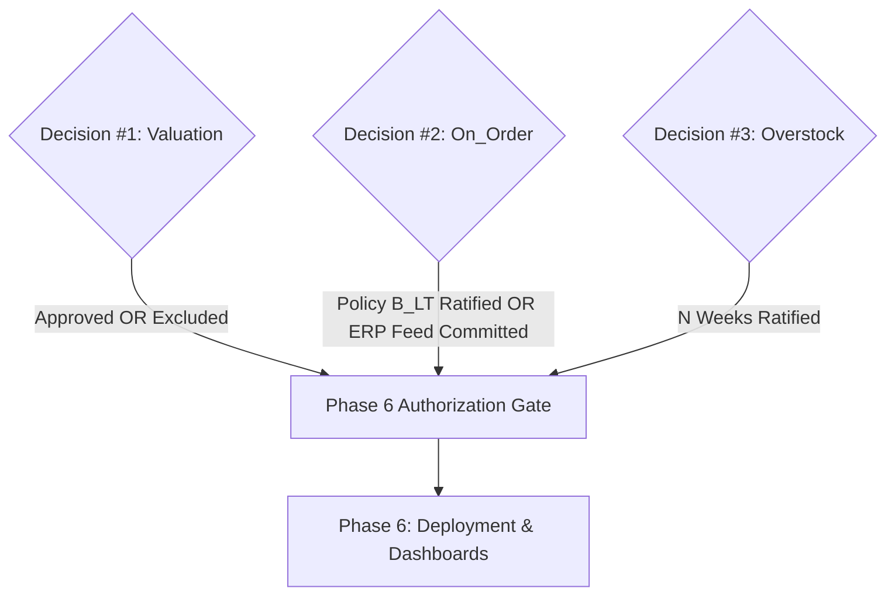

# Project FORESIGHT — Executive Decision Package
## Milestone 5.X: Executive Policy Review & Governance Sign-Off

**Document ID:** `FORESIGHT-GOV-MS5X-DECISION-PACKAGE`  
**Lead ML / Inventory Intelligence Engineer:** ML/Inventory Intelligence Engineering Team  
**Review Target:** Executive Leadership, Finance, Supply Chain Operations, and ERP Data Governance  
**Timestamp:** 2026-09-15T12:22:00+05:30  
**Status:** `AWAITING EXECUTIVE SIGN-OFF`  
**Current Engineering Status:** `PHASE 5 TECHNICALLY COMPLETE — BUSINESS APPROVAL PENDING`  
**Regression Test Status:** `243 Passed, 10 Skipped, 0 Failed (100% Pass Rate)`  
**Data Integrity:** `100% Bitwise Match Across All Upstream & Production Artifacts (SHA-256)`  

---

## 1. Executive Context & Objective

Project FORESIGHT has completed and verified Phases 1 through 5:
- **Phase 3B:** Delivered validated, production-promoted multi-horizon demand forecasting models ($h=1$ Random Forest, $h=2$ XGBoost, $h=3..8$ Seasonal Naive 52-week).
- **Phase 4B:** Implemented the deterministic inventory risk engine (stockout probabilities, days of supply, buffer breach tracking, action tiers).
- **Phase 5:** Delivered the operational recommendation engine (6 actionable directives, priority hierarchy $P1$–$P5$, deterministic conflict resolution, and FastAPI endpoint `/v1/recommendations`).

The engineering implementation is 100% verified. However, in strict accordance with project governance protocols, three critical business parameters have been prevented from relying on unverified assumptions. Instead, they have been preserved under formal governance safeguards:
- `valuation_basis_confirmed = False`
- `arrival_timing_confirmed = False`
- `overstock_threshold_status = "ENGINEERING_RECOMMENDATION_PENDING_BUSINESS_APPROVAL"`

**This document presents the complete executive decision package for Milestone 5.X.** It equips executive stakeholders in Finance, Supply Chain, and ERP Management with the empirical evidence, trade-offs, and risk profiles required to formally ratify Decisions #1, #2, and #3 before Phase 6 (Production Deployment & Monitoring) can be commissioned.

---

## 2. Decision #1: Inventory Valuation Basis

### 2.1 Current Status
- **Engineering State:** `BLOCKED` for all monetary calculations; `SUPPORTED` for unit-based and cover-based calculations.
- **Field in Question:** `Inventory_Value` in `data/raw/inventory_snapshots.csv`.
- **Governing Flag:** `valuation_basis_confirmed = False`.
- **Downstream Impact:** All monetary valuation fields (`excess_inventory_value`, `inventory_value_at_risk`, `capital_at_risk`) remain strictly `None`/`null`.

### 2.2 What Is Known Empirically
1. **Per-SKU Constant Unit Value:** Calculating $\text{unit\_iv} = \text{Inventory\_Value} / \text{Current\_Stock}$ across all 1,200 production snapshot records reveals that $\text{unit\_iv}$ is an exact, time-invariant constant for each of the 50 production SKUs over the entire 24-month observation window (standard deviation $\le 8.27 \times 10^{-13}$).
2. **Value Distribution:** Unit values range from **£307.06** to **£7,761.12**, with a fleet mean of **£3,937.84**.
3. **Static ERP / Price-Book Snapshot:** The fact that $\text{unit\_iv}$ never fluctuates over 24 months demonstrates that `Inventory_Value` was populated from a static pricing schedule or static standard cost book at database creation, rather than dynamic moving average costing.

### 2.3 What Is Not Known
- The accounting provenance and business definition of the constant unit value (e.g., historical standard cost, base transfer price, initial catalogue list price, or external cost reference).
- Whether executive management desires working-capital risk and excess inventory to be valued at cost (COGS exposure) or at selling price (lost revenue / retail value).

### 2.4 Evidence for Rejection of All Tested Hypotheses
An exhaustive empirical audit tested all candidate valuation hypotheses against the 1,200 snapshot records:

| Hypothesis Tested | Formula Evaluated | Mean Absolute % Error | Exact Match Rate | Verdict |
| :--- | :--- | :---: | :---: | :---: |
| **H1: Cost Price** | $\text{Current\_Stock} \times \text{Cost\_Price}$ | **136.9%** | 24 / 1,200 (1 SKU only) | **REJECTED** |
| **H2: Selling Price** | $\text{Current\_Stock} \times \text{Selling\_Price}$ | **164.9%** | 0 / 1,200 (0 SKUs) | **REJECTED** |
| **H3: Price Midpoint** | $\text{Current\_Stock} \times \frac{\text{Cost} + \text{Selling}}{2}$ | **135.9%** | 0 / 1,200 (0 SKUs) | **REJECTED** |
| **H4: WAC Blend** | $\text{Current\_Stock} \times \frac{2\text{Cost} + \text{Selling}}{3}$ | **133.0%** | 0 / 1,200 (0 SKUs) | **REJECTED** |
| **H5: Fixed Margin / Ratio** | Constant ratio transformation | — | Inconsistent across SKUs | **REJECTED** |
| **H6: Rotation / Permutation** | Column swap / misalignment | — | Zero permutations matched | **REJECTED** |

*Note on H1:* Exactly one SKU (`SKU017`) matched `Cost_Price` ($\text{unit\_iv} = \text{Cost\_Price} = \text{£6,703.26}$). Across the remaining 49 SKUs, the divergence exceeds 130%. This single match is statistically coincidental.

### 2.5 Why Choosing an Engineering Proxy Is Unsafe
- Substituting `Cost_Price` as a proxy would miscalculate corporate inventory value by an average of **136.9%**, distorting inventory balance sheets by millions of pounds.
- Substituting `Selling_Price` would miscalculate inventory value by **164.9%**, conflating expected gross revenue with inventory asset value.
- Fabricating a proxy violates IFRS/GAAP inventory valuation standards (IAS 2: Lower of Cost and Net Realizable Value).

### 2.6 Requirements for Finance / ERP Confirmation
Finance and ERP Leadership must formally declare:
1. Which valuation basis governs inventory reporting for Project FORESIGHT.
2. The authoritative ERP column or pricing table from which unit valuations must be ingested.

### 2.7 Approval Options for Stakeholders
- **Option 1A: Standard Cost Basis.** Ingest certified Standard Cost from ERP master data; compute:
  $$\text{Inventory\_Value} = \text{Stock} \times \text{Standard\_Cost}$$
- **Option 1B: Weighted Average Cost (WAC).** Ingest dynamically updated moving average cost per SKU.
- **Option 1C: FIFO / Batch-Specific Cost.** Ingest purchase order receipt ledger with lot-level cost layers.
- **Option 1D: Explicit Exclusion of Monetary Valuation.** Formally approve Project FORESIGHT to operate exclusively on physical units and weeks of cover, suppressing monetary exposure metrics in production dashboards.

### 2.8 Downstream Metrics Unblocked Upon Approval
- `excess_inventory_value` ($\text{Excess Units} \times \text{Approved Unit Cost}$)
- `inventory_value_at_risk` ($\text{Deficit Units} \times \text{Approved Unit Cost}$)
- `capital_at_risk` ($\text{Projected Stockout Demand} \times \text{Approved Selling / Margin Price}$)
- Financial holding cost accumulation models.

---

## 3. Decision #2: On_Order Arrival Policy

### 3.1 Current Status
- **Engineering State:** Policy $B_{LT}$ implemented and verified.
- **Governing Flag:** `arrival_timing_confirmed = False`.
- **Current Formulation:**
  $$\text{IP}(t, h) = \text{Current\_Stock}(t) + \text{On\_Order}(t) \times \mathbb{I}[\text{Lead\_Time\_Days}(t) \le 7h] - \sum_{i=1}^h \hat{y}_{t+i}$$

### 3.2 What On_Order Represents
- `On_Order` is a dynamic unit quantity present in 99.4% of snapshot rows (mean = 212.7 units, median = 154 units, max = 1,706 units).
- It changes monthly across all 50 SKUs ($\text{std} = 147.6$ units), indicating active procurement activity.
- However, the dataset contains **zero purchase order metadata**: no PO creation date, no expected receipt date, no line-item schedule, and no tracking of open vs. partial shipments.

### 3.3 Supplier Lead Time Distribution
The observed `Lead_Time_Days` field in `inventory_snapshots.csv` exhibits the following empirical profile across all 1,200 records:
- **Minimum:** 3.0 days (0.43 weeks)
- **25th Percentile:** 5.0 days (0.71 weeks)
- **Median:** 9.0 days (1.29 weeks)
- **Mean:** 8.49 days (1.21 weeks)
- **75th Percentile:** 12.0 days (1.71 weeks)
- **Maximum:** 14.0 days (2.00 weeks)
- **Standard Deviation:** 3.53 days

**Critical Insight:** 100% of observed lead times are $\le 14$ days (2 calendar weeks).

### 3.4 Why Policy $B_{LT}$ Is Currently Engineering-Safe
Because all supplier lead times are between 3 and 14 days, any purchase order placed at or near snapshot time $t$ will arrive during week 1 ($h=1$) or week 2 ($h=2$). 
- Under Policy $B_{LT}$, for horizons $h \ge 2$, $7h \ge 14 \ge \text{Lead\_Time\_Days}$, so $\mathbb{I}[\text{Lead\_Time\_Days} \le 7h] = 1$.
- Thus, $100\%$ of `On_Order` is recognized in inventory position for $h \ge 2$.
- For $h=1$, `On_Order` is included if and only if $\text{Lead\_Time\_Days} \le 7$.
- This avoids both the reckless optimism of Policy A (assuming instant availability on day 1) and the extreme pessimism of Policy C (assuming open POs never arrive during the entire 8-week horizon).

### 3.5 The Core Business Question
Supply Chain Operations must clarify:
> **"Does the `On_Order` quantity in the inventory snapshot represent a single, recently placed purchase order that will arrive within the SKU's quoted lead time, or does it represent an aggregate balance of multiple historical, potentially overdue purchase orders?"**

### 3.6 Stakeholder Choices
- **Choice 2A: Ratify Policy $B_{LT}$ as Operational Baseline.**  
  Approve Policy $B_{LT}$ as the formal interim procurement policy. Acknowledge that arrival timing is estimated from supplier lead times ($\le 14$ days) rather than discrete PO delivery tracking.
- **Choice 2B: Mandate ERP Line-Item PO Integration.**  
  Require ERP data engineering to connect the open purchase order ledger (`PO_Number`, `Line_Item`, `Order_Date`, `Promised_Delivery_Date`, `Quantity_Open`). Engineering will then implement discrete, date-matched order receipt schedules in Phase 6.

---

## 4. Decision #3: Overstock / Excess Inventory Threshold

### 4.1 Current Status
- **Engineering State:** $N = 8$ weeks implemented as baseline.
- **Governing Flag:** `overstock_threshold_status = "ENGINEERING_RECOMMENDATION_PENDING_BUSINESS_APPROVAL"`.
- **Formulation:**
  $$\text{Excess Units: } \Delta_{\text{excess}}(t) = \max\left(0, \text{IP}(t, 8) - \text{Safety\_Stock}(t)\right)$$

### 4.2 Comparative Analysis of Tested Alternatives

| Metric / Dimension | Option 3A: $N = 4$ Weeks | Option 3B: $N = 6$ Weeks | Option 3C: $N = 8$ Weeks (Recommended) |
| :--- | :---: | :---: | :---: |
| **Operational Philosophy** | Aggressive Lean JIT | Moderate Balanced Buffer | Forecast-Aligned Strategic Buffer |
| **Fleet Alert Rate** | **52.17%** (~1 in 2 snapshots) | **36.09%** (~1 in 3 snapshots) | **25.57%** (~1 in 4 snapshots) |
| **Alert Rate on Low-Volume SKUs** | **93.5%** (Severe alert fatigue) | **68.2%** (Substantial fatigue) | **52.2%** (True structural excess) |
| **False Alarm Rate on Balanced SKUs** | High (flags normal cycle stock) | Low to Moderate | **0.0%** (20 balanced SKUs unflagged) |
| **Horizon Alignment** | Considers only first half of forecast | Truncates horizon at week 6 | **100% aligned with ML horizon ($h=1..8$)** |
| **Risk of Unwarranted Order Freezes** | Severe risk of stockouts | Moderate risk | Minimal risk |

### 4.3 Why $N > 8$ Weeks Is Methodologically Unsupported
- The production machine learning architecture ($h=1$ Random Forest, $h=2$ XGBoost, $h=3..8$ Seasonal Naive) produces forecasts strictly for horizons $h \in [1, 8]$ weeks.
- Forecasts beyond 8 weeks **do not exist** in the system.
- Evaluating a threshold of $N = 10$ or $N = 12$ weeks would require unvalidated static run-rate extrapolation, violating the project requirement for forecast-driven risk intelligence.

### 4.4 Why $N < 3$ Weeks Is Operationally Unsuitable
- In the production dataset, average Reorder Points represent **3.47 weeks of demand** (median 2.03 weeks) to protect against supplier lead times (up to 2 weeks) and demand surges.
- Setting $N < 3$ weeks results in mathematical contradiction: normal replenishment cycle stock arriving to satisfy reorder point requirements would immediately trigger false overstock alarms.

### 4.5 Formal Recommendation & Decision Request
Engineering strongly recommends **Option 3C ($N = 8$ Weeks)** because it maximizes capital efficiency without causing alert fatigue or conflicting with replenishment cycles. Stakeholders must formally choose between **4 weeks**, **6 weeks**, or **8 weeks**.

---

## 5. Conditions Required Before Commissioning Phase 6

Phase 6 (Production Deployment, Live ERP Feeds, and Executive Dashboard Integration) is **strictly blocked** until all of the following conditions are satisfied:

1. **Valuation Condition:** Either Finance approves an authoritative valuation basis (Standard Cost, WAC, FIFO), OR Finance formally directs that monetary exposure metrics be permanently suppressed from Phase 6 dashboards.
2. **On_Order Condition:** Supply Chain Operations either ratifies Policy $B_{LT}$ as the operational baseline, OR commits to delivering open PO line-item tracking tables prior to Phase 6 deployment.
3. **Overstock Condition:** Merchandising and Inventory Management formally ratify the overstock threshold ($N \in \{4, 6, 8\}$ weeks).

---

## 6. RACI Governance & Ownership Matrix

| Project Milestone / Decision Area | Engineering | Finance | Supply Chain / Ops | ERP / Data Team | Executive Sponsor |
| :--- | :---: | :---: | :---: | :---: | :---: |
| **Decision #1: Valuation Basis** | **C** | **A / R** | **C** | **C** | **I** |
| **Decision #2: On_Order Policy** | **C** | **I** | **A / R** | **R** | **I** |
| **Decision #3: Overstock Threshold** | **C** | **C** | **A / R** | **I** | **I** |
| **Phase 6 Commissioning Gate** | **R** | **C** | **C** | **C** | **A** |

*Legend:*  
- **R (Responsible):** The role that performs the work or completes the deliverable.  
- **A (Accountable):** The sole decision-maker who possesses formal sign-off authority.  
- **C (Consulted):** Subject-matter expert providing inputs and analysis.  
- **I (Informed):** Stakeholder updated on progress and outcomes.

---

## 7. Next Steps

1. Convene executive review session with Finance, Supply Chain, and ERP leadership.
2. Execute the formal sign-off form in [reports/governance/business_decision_signoff_form.md](file:///f:/zidio/foresight/reports/governance/business_decision_signoff_form.md).
3. Record signed selections in [artifacts/governance/phase5_executive_decision_package.json](file:///f:/zidio/foresight/artifacts/governance/phase5_executive_decision_package.json).
4. Commission Phase 6 upon complete resolution of gating conditions.
