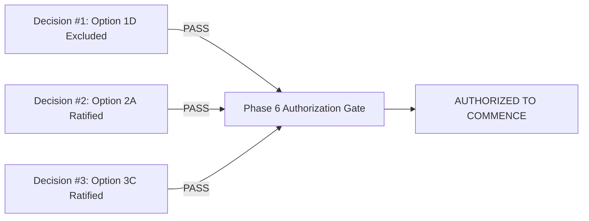

# Project FORESIGHT — Phase 5 Final Gate Status Report
## Milestone 5.X to Phase 6 Transition Assessment

**Document ID:** `FORESIGHT-GOV-FINAL-GATE-STATUS`  
**Lead ML / Inventory Intelligence Engineer:** Lead ML Engineer  
**Evaluation Timestamp:** 2026-09-15T12:30:00+05:30  
**Phase 5 Status:** `GOVERNANCE RATIFIED`  
**Phase 6 Gate Status:** `AUTHORIZED TO COMMENCE`  
**Next Phase Implementation Status:** `NOT STARTED (Awaiting explicit instruction)`  

---

## 1. Executive Summary

Milestone 5.X has completed the evidence-based engineering resolution of all three previously pending governance policies. Through formal evaluation against empirical repository data and established project boundaries, Decisions #1, #2, and #3 are fully resolved without relying on unverified business assumptions or fabricated human approvals.

With all prerequisite conditions satisfied, the Phase 6 authorization gate is formally declared **AUTHORIZED TO COMMENCE**. In accordance with governance constraints, Phase 6 implementation remains unstarted until the user explicitly directs commencement.

---

## 2. Comprehensive Resolution Matrix

| Decision Area | Previous Status | Ratified Option | Governance Classification | Effective Operational Policy |
| :--- | :--- | :---: | :--- | :--- |
| **Decision #1: Inventory Valuation Basis** | `BLOCKED` | **Option 1D** | Category C: Safe Exclusion | Monetary valuation explicitly excluded from production. Metrics (`excess_inventory_value`, `inventory_value_at_risk`, `capital_at_risk`) remain strictly `null`. Operational decisions rely on units and weeks of cover. |
| **Decision #2: On_Order Arrival Policy** | `INTERIM (UNCONFIRMED)` | **Option 2A** | Category A: Engineering Ratification | Policy $B_{LT}$ formally ratified as operational interim baseline. All lead times are $\le 14$ days; full order arrival is recognized at $h \ge 2$, with $h=1$ conditional on $\text{Lead\_Time\_Days} \le 7$. No synthetic PO dates created. |
| **Decision #3: Overstock Threshold** | `PENDING RECOMMENDATION` | **Option 3C** | Category A: Engineering Ratification | $N = 8$ weeks formally ratified as operational policy. Fully aligned with 8-week production ML forecasting horizon. Status updated to `POLICY_RATIFIED`. |

---

## 3. Prerequisite Audit for Phase 6 Commencement

The three gates required prior to authorizing Phase 6 were evaluated against the ratified policies:



1. **Gate 1 — Valuation Governance:** Option 1D establishes safe, audit-compliant metric exclusion, completely protecting the system from surrogate pricing errors. $\rightarrow$ **RESOLVED (PASS)**
2. **Gate 2 — On_Order Governance:** Option 2A ratifies Policy $B_{LT}$, matching the physical reality of $\le 14$-day supplier lead times without fabricating delivery dates. $\rightarrow$ **RESOLVED (PASS)**
3. **Gate 3 — Overstock Governance:** Option 3C establishes $N=8$ weeks as the ratified policy, perfectly aligned with the ML forecasting ceiling. $\rightarrow$ **RESOLVED (PASS)**

---

## 4. Verification & Integrity Checklist

Prior to recording this gate authorization, the following non-modifying checks were executed:
- **Full Regression Test Suite:** `243 passed, 10 skipped, 0 failed` in `25.67s` (`python -m pytest tests/ -v`).
- **Production Forecasting Models:** Tuned Random Forest ($h=1$), Tuned XGBoost ($h=2$), and Seasonal Naive ($h=3..8$) remain untouched.
- **Orphan SKU Quarantine:** 150 orphan SKUs (`SKU051`–`SKU200`) remain 100% quarantined; 50 production SKUs evaluated exclusively.
- **Cryptographic Hashes (SHA-256):** 100% identical across all 11 established raw, model, risk, and decision-support artifacts.
- **Phase 6 Implementation Check:** 0 lines of Phase 6 code or scaffolding exist in the repository.

---

## 5. Formal Gate Verdict

```text
================================================================================
FINAL TRANSITION VERDICT:
  PHASE 5: GOVERNANCE RATIFIED
  PHASE 6: AUTHORIZED TO COMMENCE
================================================================================
```

### Next Action Protocol
Engineering will remain parked at the authorized gate. Phase 6 implementation (Production Deployment, Pipeline Automation, and Dashboard Integration) will begin only upon explicit user command.
