# Project FORESIGHT — Phase 6 Implementation Plan
## Production Deployment, Pipeline Orchestration & Dashboard Integration

**Document ID:** `FORESIGHT-PHASE6-PLAN`  
**Lead Engineer:** Lead ML / Inventory Intelligence Engineer  
**Timestamp:** 2026-09-15T12:36:00+05:30  
**Phase State:** `PHASE 6 PLANNING & ARCHITECTURE RECONNAISSANCE`  
**Governance State:** `RATIFIED (Option 1D, Option 2A, Option 3C)`  
**Baseline Test Status:** `243 Passed, 10 Skipped, 0 Failed`  
**Protected Artifacts:** `100% Bitwise Verified (SHA-256)`  

---

## 1. Executive Context & Scope

With Milestone 5.X governance successfully ratified, Project FORESIGHT enters **Phase 6: Production Deployment, Pipeline Orchestration & Dashboard Integration**. 

Phase 6 operationalizes the validated forecasting models (Phase 3B), inventory risk engine (Phase 4B), decision support engine (Phase 5), and ratified governance policies into a unified, deployable, resilient software platform.

### Strict Governance Invariants
- **Decision #1 (Valuation Basis):** Option 1D — Monetary valuation explicitly excluded. `excess_inventory_value`, `inventory_value_at_risk`, and `capital_at_risk` remain strictly `None`/`null`. Zero price proxies will be used.
- **Decision #2 (On_Order Policy):** Option 2A — Policy $B_{LT}$ preserved as the operational interim baseline based on verified supplier lead times $\le 14$ days. No synthetic PO arrival dates will be fabricated.
- **Decision #3 (Overstock Threshold):** Option 3C — $N=8$ weeks ratified as the operational overstock policy, fully aligned with the 8-week production ML forecast horizon.
- **Production Universe:** Strictly restricted to 50 active production SKUs (`SKU001`–`SKU050`). The 150 orphan SKUs (`SKU051`–`SKU200`) remain 100% quarantined.

### Protected Artifacts (Zero Modification Policy)
The following 11 artifacts are strictly read-only and immutable:
1. `data/raw/inventory_snapshots.csv`
2. `data/raw/sku_master.csv`
3. `data/processed/analysis_ready.parquet`
4. `models/production/models/random_forest_h1.joblib`
5. `models/production/models/xgboost_h2.joblib`
6. `artifacts/risk/risk_scores_panel.parquet`
7. `artifacts/risk/risk_scores_latest.parquet`
8. `artifacts/risk/risk_latest.json`
9. `artifacts/decision_support/recommendations_panel.parquet`
10. `artifacts/decision_support/recommendations_latest.parquet`
11. `artifacts/decision_support/recommendation_summary.json`

---

## 2. Repository Reconnaissance & Architectural Baseline

An exhaustive inspection of the existing codebase establishes:
1. **Existing Services & APIs:**
   - FastAPI application in `api/main.py` with lifespan loading of production models.
   - Core inference engine in `api/inference.py` (`ProductionInferenceEngine`) supporting `/predict`, `/v1/forecast`, `/v1/risk`, and `/v1/recommendations`.
   - Data transfer schemas in `api/schemas.py`.
2. **Existing Pipeline Components:**
   - `src/pipeline.py` implements Phase 1A (`ingest`, `validate`) and Phase 1B (`preprocess`), with subsequent stages raising `NotImplementedError`.
   - `src/risk_scoring.py` and `src/decision_support.py` offer standalone batch processors.
3. **Existing Dashboard Collateral:**
   - `app/streamlit_app.py` is a Phase 0 skeleton.
   - `app/pages/` contains only a `README.md` defining planned multi-page layouts (`01_executive_overview.py`, `02_demand_forecast.py`, `03_inventory_risk.py`, `04_action_center.py`, `05_sku_detail.py`).
4. **Existing Deployment Infrastructure:**
   - No Dockerfiles, docker-compose configurations, or execution shell scripts currently exist.
5. **Existing Automated Test Suite:**
   - 14 test modules in `tests/` with 243 passed, 10 skipped, 0 failed.

---

## 3. Proposed Phase 6 Architecture

The target architecture organizes Phase 6 into five cohesive layers:

```mermaid
flowchart TD
    subgraph Data & Pipeline Layer
        Raw[Raw Ingestion / Snapshots] --> AR[Analysis Ready Parquet]
        AR --> Pipeline[Production Pipeline Orchestrator: src/production_pipeline.py]
        Pipeline --> ML[Production Models: h=1 RF, h=2 XGB, h=3..8 SN]
        ML --> Risk[Risk Engine: Phase 4B Formulations]
        Risk --> DS[Decision Support Engine: Phase 5 Directives]
        DS --> GovFilter[Governance Enforcement Filter]
        GovFilter --> ParquetOut[Batch Artifacts: artifacts/phase6/]
    end

    subgraph API Service Layer
        FastAPI[FastAPI Service: api/main.py]
        FastAPI --> HealthEP[GET /health & GET /api/status]
        FastAPI --> InvEP[GET /api/inventory & /api/inventory/sku]
        FastAPI --> RiskEP[GET /api/risk]
        FastAPI --> RecEP[GET /api/recommendations]
        FastAPI --> GovEP[GET /api/governance]
    end

    subgraph Dashboard Layer
        Streamlit[Streamlit App: app/streamlit_app.py]
        Streamlit --> P1[01 Executive Overview]
        Streamlit --> P2[02 Demand Forecast]
        Streamlit --> P3[03 Inventory Risk]
        Streamlit --> P4[04 Action Center]
        Streamlit --> P5[05 SKU Detail Drilldown]
    end

    subgraph Deployment & Ops
        Docker[Dockerfile & docker-compose.yml]
        Scripts[Control Scripts: scripts/run_*.bat / .sh]
        Runbooks[Runbooks & Architecture: reports/phase6/]
    end
```

---

## 4. Planned Implementation Work Breakdown

### Component 1: Unified Production Pipeline Orchestration
- **File:** `src/production_pipeline.py` [NEW]
- **Responsibilities:**
  - Execute the full sequential DAG:
    $$\text{INGEST} \rightarrow \text{VALIDATE} \rightarrow \text{LOAD MODELS} \rightarrow \text{FORECAST} \rightarrow \text{INVENTORY POSITION} \rightarrow \text{RISK SCORING} \rightarrow \text{DECISION SUPPORT} \rightarrow \text{GOVERNANCE FILTER} \rightarrow \text{SERVE / EXPORT}$$
  - Stateless execution, fail-safe validation checks, quarantine verification (`SKU051`–`SKU200` rejected).
  - Profiling and structured run manifest output (`artifacts/phase6/pipeline_manifest.json`).
  - CLI interface: `python -m src.production_pipeline [--origin YYYY-MM-DD] [--export-csv]`.

### Component 2: API Extensions & Schemas
- **Files:** `api/main.py` [MODIFY], `api/schemas.py` [MODIFY], `api/inference.py` [MODIFY]
- **Responsibilities:**
  - Implement dashboard-ready GET endpoints:
    - `GET /api/status`: System uptime, active models, pipeline manifest metrics, governance status.
    - `GET /api/inventory`: Fleet inventory overview (50 production SKUs).
    - `GET /api/inventory/{sku}`: Detailed single SKU drilldown with history, stock, on-order, lead time, safety stock, and ROP.
    - `GET /api/risk`: Latest risk scores and breach timelines.
    - `GET /api/recommendations`: Latest prioritized operational recommendations.
    - `GET /api/governance`: Active governance metadata and policy constraints.
  - Enforce strict nullness on monetary metrics (`monetary_valuation_blocked: true`).

### Component 3: Production Streamlit Dashboard
- **Files:** `app/streamlit_app.py` [MODIFY], `app/pages/01_executive_overview.py` [NEW], `app/pages/02_demand_forecast.py` [NEW], `app/pages/03_inventory_risk.py` [NEW], `app/pages/04_action_center.py` [NEW], `app/pages/05_sku_detail.py` [NEW]
- **Responsibilities:**
  - Executive Overview: Fleet KPIs (units on hand, pipeline units, stockout risk count, surplus count, fleet WAPE).
  - Demand Forecast: 8-week forward forecast curve per SKU with multi-horizon confidence intervals and model lineage.
  - Inventory Risk: SKU risk heatmap, action tier breakdown, Days of Supply, and breach timeline.
  - Action Center: Prioritized operational recommendations ($P1$–$P5$), filtering by urgency, category, and responsible role.
  - SKU Detail: 360-degree SKU drilldown combining attributes, demand history, forecast curve, and inventory trajectory.
  - Zero monetary exposure displayed.

### Component 4: Containerization & Deployment Scripts
- **Files:** `Dockerfile` [NEW], `docker-compose.yml` [NEW], `.dockerignore` [NEW], `scripts/run_api.bat` / `.sh` [NEW], `scripts/run_dashboard.bat` / `.sh` [NEW], `scripts/run_pipeline.bat` / `.sh` [NEW]
- **Responsibilities:**
  - Dual-service Docker setup (`api` on port 8000, `dashboard` on port 8501).
  - Cross-platform launch scripts.

### Component 5: Automated Testing Suite
- **File:** `tests/test_phase6_production.py` [NEW]
- **Responsibilities:**
  - Test pipeline DAG execution, manifest generation, orphan SKU quarantine, monetary metric blocking, all new API endpoints, dashboard data contracts, and error handling.

### Component 6: Documentation & Operations Suite
- **Files:** `reports/phase6/phase6_architecture.md`, `phase6_deployment_runbook.md`, `phase6_api_contract.md`, `phase6_operations_runbook.md`, `phase6_completion_audit.md`, `artifacts/phase6/phase6_status.json`.

---

## 5. Verification Plan

1. **Automated Unit & Integration Testing:**
   - Run `python -m pytest tests/test_phase6_production.py -v`
   - Run full regression suite `python -m pytest tests/ -v` (expect ~253 passed, 0 failed).
2. **Cryptographic Integrity Audit:**
   - Verify that all 11 protected artifacts match their pre-implementation SHA-256 digests.
3. **Manual Functional Checks:**
   - Execute production pipeline batch run.
   - Query all API endpoints via HTTP test client.
   - Verify clean syntax and import execution of all 5 Streamlit dashboard pages.
